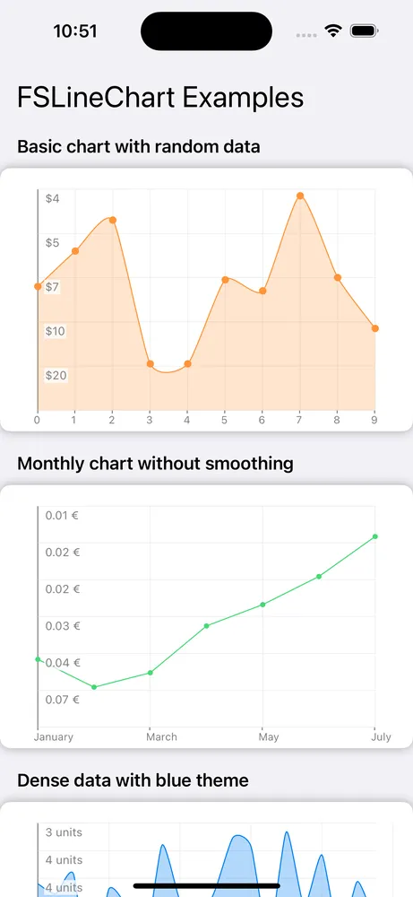
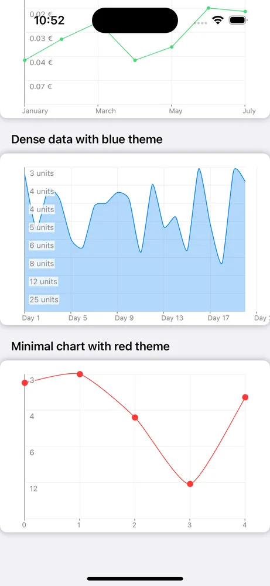

# FSLineChart

A line chart library for iOS.

## Screenshots

 


## Installing FSLineChart

Add this to your project using Swift Package Manager. In Xcode, go to: File > Swift Packages > Add Package Dependency... and follow the prompts. Alternative installation options are available for legacy projects.

## How to use

FSLineChart is a subclass of `UIView`, so it can be added as a regular view. Use the `ChartLabels` structure to format the values displayed on the chart. Here’s a simple Swift example:

```swift
import FSLineChart

let chart = FSLineChart(frame: CGRect(x: 0, y: 0, width: 300, height: 200))

// Generate some dummy data
let data = (0..<10).map { _ in Double.random(in: 20...120) }

// Configure labels
let labels = ChartLabels(
    indexLabel: { "\($0)" },
    valueLabel: { String(format: "$%.0f", $0) }
)
chart.setLabels(labels)

// Configure style
let style = ChartStyle(
    axisColor: .gray,
    axisLineWidth: 1,
    lineColor: .fsOrange,
    fillColor: UIColor.fsOrange.withAlphaComponent(0.25),
    lineWidth: 1,
    displayDataPoints: true,
    dataPointColor: .fsOrange,
    dataPointBackgroundColor: .fsOrange,
    dataPointRadius: 3,
    drawInnerGrid: true,
    innerGridColor: UIColor(white: 0.9, alpha: 1.0),
    innerGridLineWidth: 0.5,
    gridSteps: (vertical: 5, horizontal: 9),
    margin: 20,
    bezierSmoothing: true,
    bezierSmoothingTension: 0.2,
    animationDuration: 0.5,
    indexLabelFont: .systemFont(ofSize: 10),
    indexLabelColor: .gray,
    indexLabelBackgroundColor: .clear,
    valueLabelFont: .systemFont(ofSize: 11),
    valueLabelColor: .gray,
    valueLabelBackgroundColor: UIColor(white: 1, alpha: 0.75),
    valueLabelPosition: .mirrored
)
chart.applyStyle(style)

// Set data and render
try? chart.setChartData(data)
```

You can customize the chart’s appearance using the `ChartStyle` structure. The style and labels must be set before calling `setChartData`. Here are the available `ChartStyle` properties:

```swift
public struct ChartStyle {
    public let axisColor: UIColor
    public let axisLineWidth: CGFloat
    public let lineColor: UIColor
    public let fillColor: UIColor?
    public let lineWidth: CGFloat
    public let displayDataPoints: Bool
    public let dataPointColor: UIColor
    public let dataPointBackgroundColor: UIColor
    public let dataPointRadius: CGFloat
    public let drawInnerGrid: Bool
    public let innerGridColor: UIColor
    public let innerGridLineWidth: CGFloat
    public let gridSteps: (vertical: Int, horizontal: Int)
    public let margin: CGFloat
    public let bezierSmoothing: Bool
    public let bezierSmoothingTension: CGFloat
    public let animationDuration: TimeInterval
    public let indexLabelFont: UIFont
    public let indexLabelColor: UIColor
    public let indexLabelBackgroundColor: UIColor
    public let valueLabelFont: UIFont
    public let valueLabelColor: UIColor
    public let valueLabelBackgroundColor: UIColor
    public let valueLabelPosition: ValueLabelPosition

    public enum ValueLabelPosition {
        case left
        case right
        case mirrored
    }
}
```

The `setChartData` method may throw errors if the data is empty or contains invalid values (e.g., NaN or infinite). Handle these errors appropriately:

```swift
do {
    try chart.setChartData(data)
} catch {
    print("Failed to set chart data: \(error)")
}
```

## Examples

Clone the repository to explore a simple example project showcasing various chart configurations. For a larger integration, see FSLineChart in action in [ChartLoot](https://github.com/ArthurGuibert/ChartLoot).
